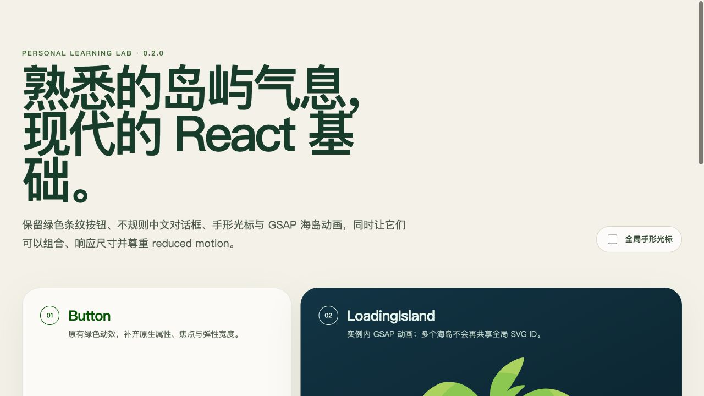
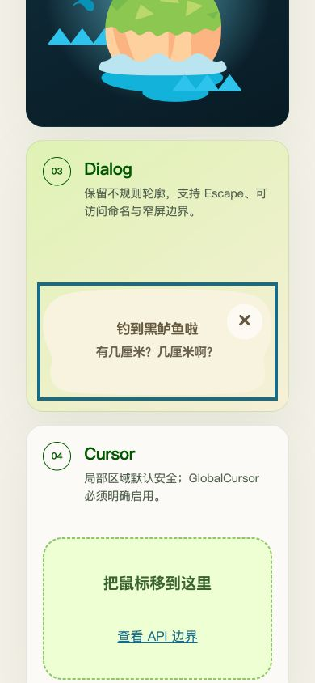
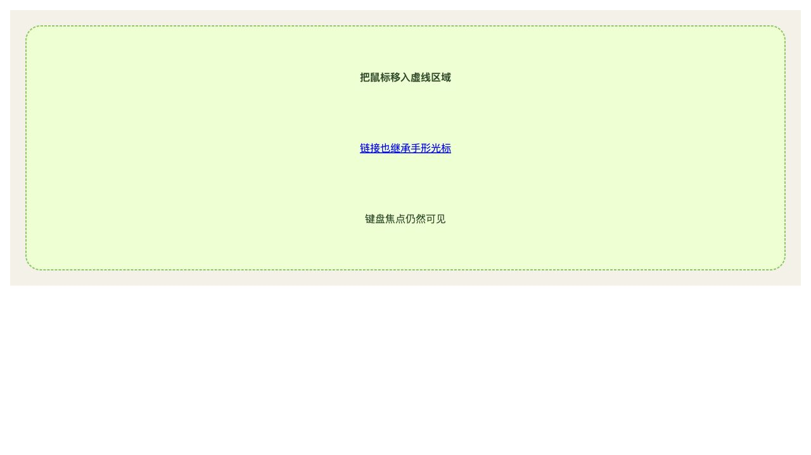

# 旧版复现与盘点

记录日期：2026-08-28。基线 commit：`16f0d81`，分支 `master`。

## 仓库边界

- clone 来源：`git@github.com:nyx2014/cute-ui.git`。
- 唯一 remote：`origin`；fetch 与 push URL 均为上述个人 GitHub 仓库。
- 本次没有读取、关联、推送或修改任何 GitLab 项目；没有 push、PR、commit 或远端设置变更。

## 旧版组件与 API

| 组件      | 旧 API                                             | 有价值的视觉                                | 已确认问题                                                                        |
| --------- | -------------------------------------------------- | ------------------------------------------- | --------------------------------------------------------------------------------- |
| `Button`  | 仅 `style?: CSSProperties`，但实际未使用；children | 绿色圆角、hover 条纹、active 缩放、手形光标 | 固定 400px；不转发 className/事件/HTML 属性；CSS 变量污染 `:root`                 |
| `Cursor`  | 无 props，返回 `null`                              | 49×48 手形 PNG                              | 导入即污染 `html, body`；Story 是空白页                                           |
| `Dialog`  | `style?: CSSProperties` 只传到 clipped 层          | 中文字体、米色不规则轮廓                    | 全局 `#my-clip-path` 冲突；无 role/name/键盘关闭；字体授权未记录                  |
| `Loading` | 无 props                                           | 海岛 SVG、GSAP 浮动/树叶/水波/鱼轨迹        | `.container`、`*` 污染；99vh/100vw；全局 ID 选择器；无 effect cleanup；多实例冲突 |

CRA `App` 仍是默认 React 欢迎页，不代表组件库产品能力。Storybook 5 只有 Button、Cursor、Loading/Dialog 四个简单 Story。

## 旧依赖与构建证据

- Node：本机默认 `v20.20.2`（在记录日期已属 EOL）。
- 安装：`npm install --legacy-peer-deps` 安装约 2400 个包，并产生大量 deprecated 警告。
- 默认 `npm run build` / `npm test`：失败。CRA preflight 要求 webpack `4.42.0`，实际 hoist 到 `4.43.0`。
- 兼容运行：`SKIP_PREFLIGHT_CHECK=true NODE_OPTIONS=--openssl-legacy-provider` 后 CRA build 与唯一测试通过。
- Storybook 5.3.19：在 `NODE_OPTIONS=--openssl-legacy-provider` 下静态构建通过。
- `npm audit --json` 元数据：298 项（10 low / 223 moderate / 65 high）。
- 旧 Storybook 产物警告：字体 3.34MiB，vendor bundle 849KiB。
- git 历史存在多轮 Dependabot transitive bump，但没有解决 CRA 3 / webpack 4 / Storybook 5 的平台级债务。

## 视觉基线

这些截图由旧 Storybook 5 实际运行结果生成；没有通过源码推断视觉完成度。

### Button

### Dialog

### LoadingIsland

### Cursor 空白 Story

## 新版对照证据

响应式 smoke test 在 390×844 viewport 下确认 `document.scrollWidth === 390`，Dialog 边界为 53–337px，没有横向溢出。
